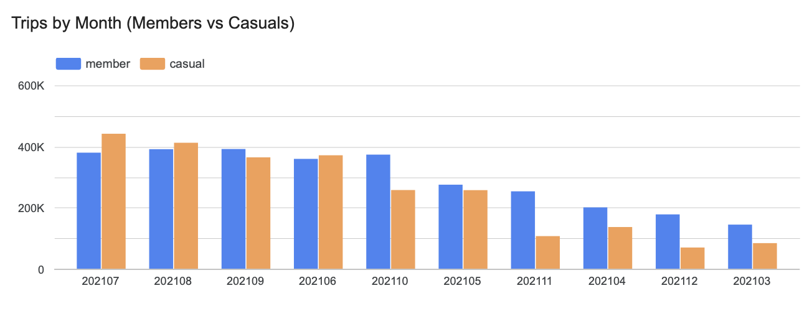
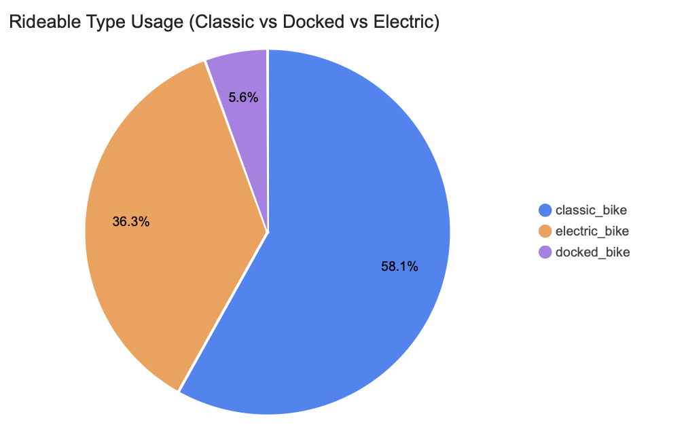
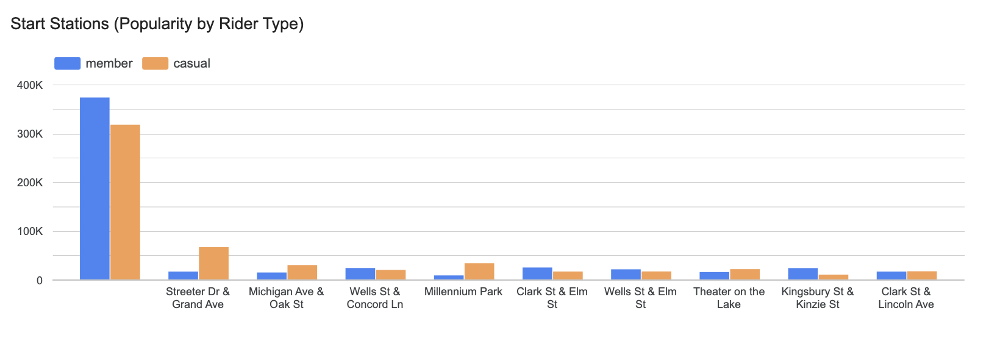
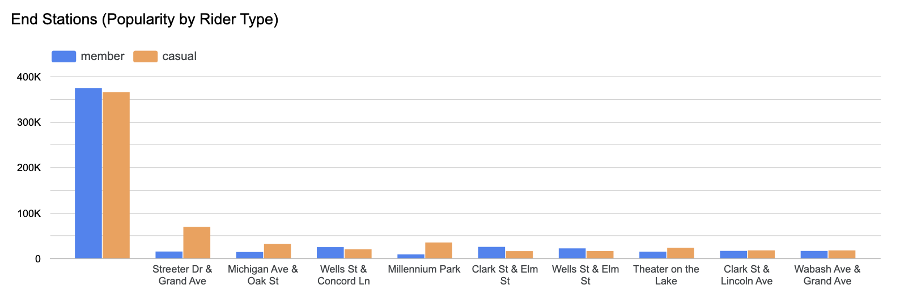

# 🚴 Cyclistic Bike-Share Case Study  
**Capstone Project**  
by *Juwita Jessica Pangestu*  

---

## 1. Business Task  
Cyclistic is a bike-share company that operates a fleet of classic, docked, and electric bikes across Chicago.  
The company’s current business model generates revenue through two primary channels:  

- **Casual riders** who purchase single-ride or day passes.  
- **Annual members** who pay a fixed yearly fee for unlimited rides.  

While casual riders contribute to short-term revenue, the executive team recognizes that long-term financial stability depends on increasing the proportion of annual members, who generate consistent, predictable income and demonstrate stronger retention.  

The core business challenge is that casual riders currently make up a significant share of usage but are less reliable as a long-term revenue source due to their seasonal, tourism-driven patterns. In contrast, members ride more consistently year-round, often integrating bike usage into daily commuting or habitual travel.  

**Business Question:**  
> Identify how casual riders and annual members differ in their usage behavior, and provide data-driven recommendations to convert casual riders into annual members.  

This analysis will inform Cyclistic’s **marketing, fleet allocation, and station placement strategies**, ensuring resources are aligned to maximize profitability and accelerate membership growth.  

---

## 2. Data Preparation  

The dataset used consists of **12 months of historical Cyclistic bike trip data (Jan–Dec 2021)**. Each file represented one month of trips in CSV format and contained consistent schema across months, including key variables such as:  
`ride_id`, `rideable_type`, `started_at`, `ended_at`, `start_station_name`, `end_station_name`, and `member_casual`.  

### 2.1 Data Collection  
- **Source:** Publicly available Cyclistic trip data.  
- **Files:** 12 monthly CSVs merged into one consolidated dataset containing **5M+ rows of trip records**.  

### 2.2 Data Cleaning (SQL in BigQuery)  
Steps performed to ensure accuracy and reliability:  
- **Data merging** – Combined 12 monthly CSVs into one dataset.  
- **Schema alignment** – Verified consistency of column structure.  
- **Null/duplicate removal** – Removed rows with missing IDs, timestamps, or station names.  
- **Invalid record filtering** – Excluded trips with negative or zero ride lengths.  

**Data Cleaning Summary:**  
- Removed **60,642 rows** with trip durations longer than one day (outliers).  
- Corrected ride length calculations for **4,588,302 rows** to ensure accuracy.  
- Dropped **1,006,761 rows** with missing values in critical fields.  

### 2.3 Data Transformation  
Created new fields to support analysis:  
- `ride_length_minutes = ended_at – started_at` (converted to minutes).  
- `day_of_week` extracted from `started_at`.  
- `month` extracted from `started_at`.  

### 2.4 Tools Used  
- **BigQuery (SQL):** Data cleaning, transformation, and analysis.  
- **Looker Studio:** Interactive dashboards and visualizations.  

---

## 3. Key Insights  

### 3.1 Trips by Month (Seasonality)  

- Casual riders peaked in **July 2021 (~450K rides)** vs. **members (~380K)**.  
- In **August**, casual riders remained high (~420K) vs. **members (~390K)**.  
- By **December**, casual rides dropped to ~70K, while members stayed steady with **150K+ rides/month**.  

➡️ **Implication:** Casual riders are seasonal and weather/tourism-driven, while members provide a reliable baseline of recurring revenue year-round.  

---

### 3.2 Rideable Type Usage  

- **Classic bikes:** 58.1% of rides  
- **Electric bikes:** 36.3% of rides  
- **Docked bikes:** 5.6% of rides  

➡️ **Insights:**  
- Casual riders prefer **electric bikes** (convenience, low effort).  
- Members rely more on **classic bikes** (lower cost, commuting utility).  
- Docked bikes are declining in importance.  

---

### 3.3 Station Popularity (Start & End)  

- **Most popular stations (casuals):** Streeter Dr & Grand Ave, Millennium Park, Michigan Ave & Oak St.  
- **Casual riders:** Concentrated in tourist hotspots, often round-trips at same station.  
- **Members:** Wider distribution, aligned with commuting and point-to-point travel.  

➡️ **Implication:**  
- Stock more bikes in **tourist hubs during summer**.  
- Expand near **business/transit hubs** for members.  

---

## 4. Profitability Considerations  

### Casual Riders  
- Higher per-ride revenue.  
-  Highly seasonal, concentrated in summer.  
-  Heavier use of electric bikes → higher operating costs.  
-  Inconsistent engagement.  

### Annual Members  
-  Predictable recurring revenue ($120–$150/year).  
-  Steady usage year-round.  
-  More reliant on cheaper-to-maintain classic bikes.  
-  Long-term value despite lower revenue per trip.  

➡️ **Conclusion:** Casual riders provide **short-term profit spikes**, but **members ensure long-term stability**.  

---

## 5. Business Recommendations  

1. **Seasonal Marketing**  
   - Launch summer promotions (discounted passes, tourist bundles).  
   - Off-season retention campaigns for members.  

2. **Membership Conversion**  
   - Introduce **3-month seasonal memberships** at tourist hubs.  
   - Offer discounts to frequent casual riders (e.g., >3 rides/week).  
   - Promote **unlimited rides & cost savings** of membership.  

3. **Fleet Optimization**  
   - Add electric bikes in tourist-heavy areas.  
   - Gradually phase out docked bikes.  

4. **Station Strategy**  
   - Ensure bike availability at tourist hotspots in summer.  
   - Expand near business districts & transit hubs.  

5. **Customer Segmentation**  
   - **Casual riders:** Fun, flexibility, convenience.  
   - **Members:** Cost savings, commuting efficiency, reliability.  

---

## 6. Conclusion  
Cyclistic’s analysis shows:  
- Casual riders = seasonal, leisure-oriented, electric bike heavy.  
- Members = consistent, commuting-driven, long-term revenue source.  

By capturing short-term profit from casual riders **and converting them into long-term members**, Cyclistic can strengthen both profitability and sustainability.  

---

## 🔧 Tools & Skills Demonstrated  
- SQL (BigQuery)  
- Looker Studio Dashboards  
- Data Cleaning & Transformation  
- Data Visualization  
- Business Strategy & Profitability Analysis  

---
